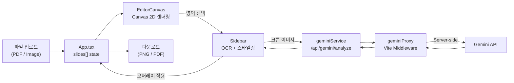

# NotebookLM Slide Editor — 코드 리뷰 보고서

**작성일:** 2026-02-14
**리뷰 대상:** 프로젝트 전체 소스 코드 (12개 파일)

---

## TL;DR

- **Server-side proxy 패턴**으로 API 키를 보호하는 구조는 우수하나, **`.env.local`에 실제 API 키가 하드코딩**되어 있어 Git 유출 위험 존재
- Canvas 기반 에디터의 핵심 로직(줌/팬/선택/드래그)은 잘 구현되었으나, **메모리 관리·에러 핸들링·프로덕션 배포** 관점에서 개선 필요
- **테스트 코드 부재**, **rate limiting 미적용**, **입력 검증 부족** 등 보안·안정성 이슈가 다수 존재

---

## 1. 프로젝트 개요

```
notebooklm-slide-editor/
├── App.tsx                    # 메인 컨테이너 (파일 업로드, 슬라이드 관리)
├── index.tsx                  # React 엔트리포인트
├── index.html                 # HTML 셸 (CDN 라이브러리 로드)
├── types.ts                   # TypeScript 타입 정의
├── constants.ts               # 상수 (색상, 줌 제한 등)
├── components/
│   ├── EditorCanvas.tsx       # Canvas 기반 에디터 (줌/팬/선택/드래그)
│   └── Sidebar.tsx            # AI OCR 분석 + 텍스트 스타일링 패널
├── services/
│   ├── geminiService.ts       # Gemini API 클라이언트 (프록시 호출)
│   └── pdfService.ts          # PDF→이미지 변환 / PDF 다운로드
├── utils/
│   └── renderOverlay.ts       # 텍스트 오버레이 렌더링 공용 함수
├── server/
│   └── geminiProxy.ts         # Vite 미들웨어 (서버 측 Gemini API 프록시)
└── vite.config.ts             # Vite 빌드 설정
```

---

## 2. 작동 원리 & 아키텍처

### 2.1 전체 데이터 흐름



### 2.2 핵심 상태 관리

| State | 위치 | 설명 |
|-------|------|------|
| `slides[]` | `App.tsx` | 모든 슬라이드 데이터 (이미지 + 오버레이 배열) |
| `activeSlideIdx` | `App.tsx` | 현재 활성 슬라이드 인덱스 |
| `selection` | `EditorCanvas` | 드래그로 생성한 선택 영역 (Rect) |
| `selectedOverlayId` | `App.tsx` | 현재 선택된 오버레이 ID |
| `zoom` / `offset` | `EditorCanvas` | 캔버스 줌 레벨 및 팬 오프셋 |

### 2.3 렌더링 파이프라인

1. **이미지 로드** → `slide.dataUrl`을 `HTMLImageElement`로 로드
2. **캔버스 변환** → `ctx.translate(offset)` + `ctx.scale(zoom)`
3. **베이스 이미지 그리기** → `ctx.drawImage(image, 0, 0)`
4. **오버레이 렌더링** → `renderOverlayToCanvas()` (배경색 → 폰트 → 정렬 → 텍스트)
5. **선택 UI** → 선택 영역 테두리 + 리사이즈 핸들 8개

### 2.4 AI OCR 흐름

1. 사용자가 캔버스에서 영역 선택
2. Sidebar에서 "AI 분석" 클릭 → 선택 영역을 **크롭 후 base64 인코딩**
3. `geminiService.ts` → `/api/gemini/analyze`로 POST
4. `geminiProxy.ts` (Vite 미들웨어) → **서버 측에서** Gemini API 호출
5. 응답: `{text, fontSize, fontWeight, fontColor, fontFamily, backgroundColor, language}`
6. 결과를 Sidebar UI에 반영 → 사용자가 텍스트 수정 후 적용

---

## 3. 보안 분석

### 🔴 Critical

#### S1: API 키 하드코딩 (`.env.local`)

```
GEMINI_API_KEY=your_api_key_here
```

- `.gitignore`에 `*.local` 패턴으로 제외되어 있으나, **실제 API 키가 파일에 존재**
- 이 키가 이미 다른 곳에 노출되었다면 즉시 **rotate** 필요
- **해결:** `.env.example`에 placeholder만 두고, 실제 키는 각 환경에서 주입

#### S2: 프로덕션 배포 시 API 프록시 부재

```typescript
// geminiProxy.ts는 Vite 개발 서버 전용 (configureServer)
// 프로덕션 빌드(vite build)에서는 이 미들웨어가 동작하지 않음
```

- `vite build` 후 정적 파일만 생성되므로 **API 프록시가 없음**
- 프로덕션 환경에서는 별도 백엔드(Express/Fastify/Cloud Function) 필요
- 현재 상태에서 프로덕션 배포 시 **OCR 기능이 완전히 작동 불가**

### 🟡 High

#### S3: Request Body 크기 제한 없음

```typescript
// geminiProxy.ts
const chunks: Buffer[] = [];
for await (const chunk of req) {
    chunks.push(chunk);  // 무제한 메모리 소비 가능
}
```

- base64 인코딩된 이미지를 body로 받지만 **크기 제한이 없음**
- 대형 이미지 전송 시 서버 메모리 고갈 가능 (DoS 벡터)
- **해결:** body 파싱 시 `Content-Length` 헤더 검사 또는 스트림 크기 제한 (예: 10MB)

#### S4: Rate Limiting 미적용

- `/api/gemini/analyze` 엔드포인트에 Rate Limiting 없음
- 악의적 사용자가 Gemini API를 무제한 호출하여 **비용 폭탄** 가능
- **해결:** IP 기반 rate limiting (개발 환경에서도 방어적 코딩 권장)

### 🟢 Good (잘 처리된 부분)

- ✅ API 키를 서버 측 프록시로 분리 (`geminiProxy.ts`)
- ✅ 클라이언트 번들에 API 키 미포함 (`vite.config.ts` define 제거)
- ✅ 파일 업로드 시 MIME 타입 화이트리스트 + 크기 제한 (50MB)
- ✅ 에러 메시지에서 스택 트레이스 비노출 (사용자 친화적 메시지)
- ✅ `PLACEHOLDER_API_KEY` 체크로 미설정 상태 감지

---

## 4. 코드 품질 분석

### 4.1 강점

| 영역 | 평가 |
|------|------|
| **타입 안전성** | TypeScript 인터페이스(`TextOverlay`, `SlideData`, `OCRResult`)로 핵심 데이터 모델 정의 ✅ |
| **컴포넌트 분리** | App / EditorCanvas / Sidebar 3계층 구조로 관심사 분리 ✅ |
| **코드 재사용** | `renderOverlayToCanvas()` 유틸로 3곳(프리뷰/다운로드/PDF)의 중복 제거 ✅ |
| **캔버스 조작** | 줌/팬/드래그/리사이즈 핸들 등 전문적인 캔버스 인터랙션 구현 ✅ |
| **UX** | 키보드 단축키(Space+Drag, 화살표), 커서 변경, 로딩 스피너 등 ✅ |

### 4.2 문제점 및 개선 제안

#### P1: 메모리 누수 — 대형 PDF DataURL 상주

```typescript
// App.tsx - 모든 슬라이드의 dataUrl(base64)이 메모리에 상주
setSlides(converted); // 50페이지 PDF → 수백 MB 메모리 소비
```

- PDF의 모든 페이지를 고해상도(scale 2.0) dataURL로 변환하여 state에 저장
- **해결:**
  - 가시 영역 슬라이드만 렌더링 (가상화)
  - `Blob URL` (`URL.createObjectURL`) 사용 후 `URL.revokeObjectURL`로 해제
  - 또는 `OffscreenCanvas` + 지연 로딩 패턴 적용

#### P2: 이미지 다운로드 로직의 race condition

```typescript
// App.tsx handleDownloadImages
slides.forEach((slide, i) => {   // 비동기 img.onload를 forEach로 순회
  const img = new Image();
  img.onload = () => {
    setTimeout(() => { link.click(); }, 100);  // 매직넘버 100ms
  };
});
```

- `forEach` 내에서 비동기 작업을 fire-and-forget으로 실행
- 여러 슬라이드가 동시에 다운로드 시도 → 브라우저에 따라 일부 누락 가능
- `setTimeout(100)`은 신뢰할 수 없는 타이밍
- **해결:** `async/await` + 순차 다운로드 또는 ZIP 묶어서 한 번에 다운로드

#### P3: Undo가 단순 Pop (Undo 스택 없음)

```typescript
// App.tsx handleUndo
newOverlays.pop(); // 마지막 오버레이만 제거 — Redo 불가
```

- 전형적인 command 패턴이나 history 스택 없이 단순 `pop()`
- **해결:** undo/redo 스택 구현 또는 `immer` + history 라이브러리 활용

#### P4: `any` 타입 사용

```typescript
// pdfService.ts
declare const pdfjsLib: any;  // CDN으로 로드되는 전역 객체
declare const jspdf: any;

// EditorCanvas.tsx
const getCanvasCoords = (e: React.MouseEvent | any): Point => { ... }
```

- CDN 의존성에 대한 타입 정의 부재
- **해결:** `@types/pdfjs-dist` 설치 또는 로컬 타입 선언 파일 작성

#### P5: CDN 의존성 버전 이중 관리

```html
<!-- index.html -->
<script src="https://cdn.tailwindcss.com"></script>
<script src="https://cdnjs.cloudflare.com/ajax/libs/pdf.js/3.11.174/pdf.min.js"></script>
<script src="https://cdnjs.cloudflare.com/ajax/libs/jspdf/2.5.1/jspdf.umd.min.js"></script>
```

- `pdf.js`와 `jspdf`는 CDN에서 로드, React/Lucide는 npm에서 관리
- 버전 충돌·캐시 문제·오프라인 환경 미지원
- **해결:** 모든 의존성을 npm으로 통합하거나, 최소한 `integrity` 해시 추가

#### P6: `useEffect` 의존성 배열 경고 가능성

```typescript
// EditorCanvas.tsx
useEffect(() => { /* keydown/keyup */ }, []);  // 빈 의존성 — 정상 동작하나 ESLint 경고 가능
```

```typescript
// Sidebar.tsx
useEffect(() => {
  if (selectedOverlay) { ... }
}, [selectedOverlayId]);  // selectedOverlay가 의존성에 없음
```

- `selectedOverlayId`가 바뀌지 않고 overlays 내용만 변경되면 동기화 누락

#### P7: Canvas DPI 미처리

```typescript
// EditorCanvas.tsx draw()
if (canvas.width !== rect.width || canvas.height !== rect.height) {
  canvas.width = rect.width;
  canvas.height = rect.height;
}
```

- `window.devicePixelRatio` 미반영 → Retina 디스플레이에서 흐릿하게 렌더링
- **해결:** `canvas.width = rect.width * dpr` + `ctx.scale(dpr, dpr)`

#### P8: 프록시 에러 응답에 fallback 데이터 포함

```typescript
// geminiProxy.ts catch block
res.end(JSON.stringify({
    error: 'AI 분석 중 오류가 발생했습니다.',
    text: "",           // 에러인데 fallback 데이터를 함께 반환
    fontSize: 16,
    // ...
}));
```

- 에러 응답에 정상 데이터 구조를 포함하면 클라이언트에서 에러/성공 구분이 모호
- **해결:** 에러 시 `{ error: "..." }`만 반환, 클라이언트에서 `response.ok` 체크 (이미 구현됨)

---

## 5. 개선 로드맵

### 즉시 조치 (Critical)

| # | 항목 | 난이도 |
|---|------|--------|
| 1 | `.env.local`의 API 키 **rotate** + `.env.example` 분리 | ⭐ |
| 2 | Request body 크기 제한 추가 (10MB) | ⭐ |
| 3 | 프로덕션 배포 전략 수립 (서버리스 프록시 또는 Express 서버) | ⭐⭐ |

### 단기 개선 (1~2주)

| # | 항목 | 난이도 |
|---|------|--------|
| 4 | CDN 의존성 → npm 마이그레이션 (pdf.js, jspdf) | ⭐⭐ |
| 5 | Canvas DPI 처리 (Retina 지원) | ⭐ |
| 6 | 이미지 다운로드 순차 처리 + ZIP 번들 | ⭐⭐ |
| 7 | Blob URL 전환으로 메모리 최적화 | ⭐⭐ |

### 중기 개선 (1개월)

| # | 항목 | 난이도 |
|---|------|--------|
| 8 | Undo/Redo 히스토리 스택 | ⭐⭐ |
| 9 | 테스트 코드 작성 (단위 + 통합) | ⭐⭐⭐ |
| 10 | Rate Limiting + 사용량 모니터링 | ⭐⭐ |
| 11 | 접근성(a11y) 개선: 키보드 네비게이션, ARIA 레이블 | ⭐⭐ |
| 12 | 모바일/터치 이벤트 대응 | ⭐⭐⭐ |

---

## 6. 총평

이 프로젝트는 **PDF/이미지 기반 AI 텍스트 교체 에디터**로서 핵심 기능이 잘 구현되어 있습니다. 특히:

- **Canvas 2D 인터랙션** (줌/팬/선택/드래그) 구현이 전문적
- **서버 사이드 API 프록시** 패턴으로 키 보호
- **렌더링 로직 공용화**(`renderOverlayToCanvas`)로 코드 중복 최소화

다만 **프로덕션 배포 불가**(프록시 부재), **메모리 관리**(대형 PDF), **보안 검증**(body 크기, rate limiting), **테스트 부재** 등의 과제가 있어, 실 서비스로 전환하려면 위 로드맵의 단계적 개선이 필요합니다.

---

> **참고:** 이 문서는 프로젝트의 모든 소스 코드(12개 파일, ~1,200 LOC)를 분석하여 작성되었습니다.
